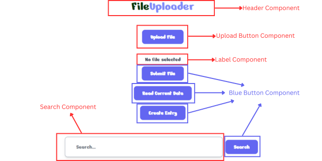

# SvelteKit Basics & Design Concepts

This markdown will contain several basics and design concepts to develop a SvelteKit project.

SvelteKit is component-based. It follows the same component-driven architecture as Svelte, where the core building blocks are reusable, self-contained components.

Each component in SvelteKit consists of three main parts:

- Script: Defines the component's logic using JavaScript or TypeScript.
- Markup: Defines the component's HTML structure.
- Style: Defines the component's scoped CSS, which is automatically applied to the component's elements.

Take note that for style we can use TailWindCSS instead of traditional CSS styling.

### Guide to start a new SvelteKit project

---

You can name the project according to your requirements, here we named it **my-app**.

Next, you can change your directory to **my-app** and execute the **npm install** command.

Finally, **npm run dev** is used to start the SvelteKit server.

```
npm create svelte@latest my-app
cd my-app
npm install
npm run dev
```

### Guide to install TailWindCSS with SvelteKit

---

To install TailWindCSS with SvelteKit, you can read it over [here](https://tailwindcss.com/docs/guides/sveltekit).

### Components

---



You can see that SvelteKit is component-based, we can design a button component to maintain a consistent design throughout. This would also help in reusability.

We first create a **components** directory in the **src** directory. This **components** directory will contain all the components you create.

Next, for this example we will create a blue button component. Therefore, inside our **components** directory we will create our file **BlueButton.svelte**.

Below is a sample code for a blue button component.

```
<script lang="ts">
  export let disabled: boolean = false; // Disabled state
  export let onClick: () => void = () => {}; // Click event handler
</script>

<button
  {disabled}
  on:click|preventDefault={onClick}
  class="m-2 px-4 py-2 bg-indigo-500 text-white font-semibold rounded-lg hover:bg-indigo-600 focus:outline-none focus:ring-2 focus:ring-indigo-500 flex items-center"
>
<!-- Insert any content that is placed between the opening and closing tags of the component -->
<slot />
</button>
```

After building the blue button component, we can reuse the component, as shown below.

```
<script>
  import BlueButton from "./BlueButton.svelte";
</script>

<div class="flex flex-col items-center py-10">
  <!-- Submit Button To Load Item List -->
  <BlueButton onClick={submitFile}>Submit File</BlueButton>

  <!-- Read button to read current data in database -->
  <BlueButton onClick={handleReadDatabase}>Read Current Data</BlueButton>

  <!-- Create button to create new row of data in database -->
  <BlueButton onClick={handleRedirect}>Create Entry</BlueButton>
</div>
```

> [!NOTE]
> In SvelteKit, component names are written in PascalCase. That is why for the example above, our component is named **BlueButton.svelte**.

### Routing

---

#### Static Routing

There is already a routes directory generated when you create a SvelteKit project.

For static routing in SvelteKit, inside the routes directory, you can create a directory and name it to the endpoint you want. For example, if you want it to be _localhost:5173/create-post_, you can name the directory **create-post**.

Inside the **create-post** directory you created, you should create a **+page.svelte** file that would represent a page in your application.

The sample code below is an example of **+page.svelte** within the **create-post** directory. It shows that the page for the **create-post** endpoint consist of a single CreatePost component.

```
<script>
  import CreatePost from "../../components/CreatePost.svelte";
</script>

<div class="flex flex-col">
  <CreatePost />
</div>
```

> [!NOTE]
> Your directory should be in this manner, **src/routes/create-post**

> [!NOTE]
> Components built will be used in +page.svelte files.

#### Dynamic Routing

Similar to static routing, you first create a new directory under the routes directory and name it to the endpoint you want. For example, if you want it to be _localhost:5173/update-post_, you can name the directory **update-post**.

Next, you would need to create another directory under the **update-post** directory and your directory name must start and end with square brackets. For example, the directory would be named **\[id\]**. This would result in a dynamic route to _localhost:5173/update-post/id_. The **id** is dynamic and would refer to something like your primary key for data stored inside a database table.

Lastly, inside the **\[id\]** directory will contain your **+page.svelte** or other files if neccessary.

For a tutorial on dynamic routing you can check out [here](https://www.youtube.com/watch?v=gNgQFF-tmuo).

For documentation on routing you can check out here [here](https://kit.svelte.dev/docs/routing).

> [!NOTE]
> There is no functional difference between naming the dynamic segment **\[slug\]** or **\[id\]** in SvelteKit. The names inside the square brackets are arbitrary, and the value they represent comes from the URL. You can use whatever name makes the most sense for your application.
> It also means that **id** can take in slug-based parameters as well, such as when the user tries to access on the browser the link _localhost:5173/update-post/post-twentythree_. The parameters taken in by **id** would be **post-twentythree**.

> [!NOTE]
> Your directory should be in this manner, **src/routes/update-post/\[id\]**.

### Global Storage & State Management

---

According to the official SvelteKit documentation, regarding the state management [here](https://kit.svelte.dev/docs/state-management), you should avoid shared state on the server.

This concern would mainly be on Server-Side Rendering (SSR). SSR would be discussed further below.

For example, the code below is a sample load function that is usually used in SSR. To avoid shared state on the server, we should not set the global storage in the load function.

```
import { user } from '$lib/user';

/** @type {import('./$types').PageLoad} */
export async function load({ fetch }) {
	const response = await fetch('/api/user');

	// NEVER DO THIS!
	user.set(await response.json());
}
```

Instead, we should return the value in the load function and pass it around to the components that need it.

```
export async function load({ fetch }) {
	const response = await fetch('/api/user');

	return {
		user: await response.json()
	};
}
```

### Server-Side Rendering (SSR)

---

SSR allows the server to generate the full HTML for a web page before sending it to the client. There are several benefits to using SSR, such as faster initial page load, better SEO, etc.

You can create and use either **+page.server.js** or **+page.js** for SSR. The file created should be located inside the routes directory. For example if you want to do SSR for **update-post**, you would create the file in the **update-post/\[id\]** directory.

Inside this file, it would contain your load function. When we try to access on the browser _localhost:5173/update-post/4_, **params** would be _{ id: 4 }_. This is because we named our directory **\[id\]**. Then, we use the id to do our API call and return the value received.

```
export const load = async ({ fetch, params }) => {
  console.log(params);

  const fetchData = async (id) => {
    const response = await fetch(`${API_URL}/file-upload/read-data/${id}`);
    if (response.ok) {
      const post = await response.json();
      return post;
    } else {
      console.error("Failed to fetch post data");
      return null; // Ensure it returns a value even if there's an error
    }
  };

  const post = await fetchData(params.id); // Await the data

  return {
    post: post
  };
};
```

For a tutorial on SSR, you can check out [here](https://www.youtube.com/watch?v=EQy-AYhZIlE&t=20s).

> [!WARNING]
> There is a difference between using **+page.server.js** and **+page.js**.
> **+page.server.js** is server-only loading. It will only run on the server.
> **+page.js** is hybrid SSR and client-side loading. It will run on both the server and the client.
> | Feature | `+page.server.js` | `+page.js` |
> |-----------------------|------------------------------------|------------------------------------|
> | **Runs on** | Server only | Both client and server |
> | **Client-Side Navigation** | Not triggered on client-side navigation | Runs on the client after the initial SSR |
> | **Security** | Can handle sensitive logic (e.g., private API keys, database access) | Must avoid exposing sensitive data |
> | **Use case** | Fetching sensitive data or performing secure operations | Fetching public data that can be done on client and server |
> | **Exposes logic to client** | No (server-side logic only) | Yes (during client-side navigation) |

### Client-Side Rendering (CSR)

---

For CSR, the initial HTML sent by the server is a barebones document with minimal content. JavaScript code which runs on the client-side would be used to fetch data, update the user interface, handle user interactions, etc. For example, when a user clicks on a button, it triggers the JavaScript code to call an API to perform certain operations.

The example below is a function that is triggered when the user clicks on the button to delete a post.

```
async function removeData(id: number) {
  try {
    const response = await fetch(
      `${apiBaseUrl}/file-upload/delete-data/${id}`,
      {
        method: "DELETE",
      }
    );

    if (response.ok) {
      // Re-fetch list of items after a successful delete of the entry
      fetchItems();
      console.log("Entry deleted successfully. Status: ", response.status);
    } else {
      console.error("Failed to delete entry. Status: ", response.status);
    }
  } catch (error) {
    console.error("Error:", error);
  }
}
```

### Server Sent Events (SSE)

---

SSE is used for sending real-time updates from a server to the client over an HTTP connection. By using SSE, server can push updates to the client continuously without the client having to request repeatedly. However, SSE is unidirectional, which means that only the server streams data to the client over a long-lived connection. Also, SSE only supports text-based data like JSON.

To handle SSE connection on the client side, we will need to use **EventSource** to connect to the SSE endpoint.

Once connected, we will parse the JSON message and you can use the data to perform operations.

```
// Open SSE connection
const eventSource = new EventSource("https://127.0.0.1:3000/sse-stats/sse");

eventSource.onmessage = function (event) {
  const data = JSON.parse(event.data);
  const ampere = data.readings.ampere;
  const voltage = data.readings.voltage;
  const timestamp = data.timestamp;

  // Update the data arrays, remove the first item if more than 10 items
  if (timeStamps.length >= 10) {
    timeStamps.shift();
    ampereData.shift();
    voltageData.shift();
  }

  // Update the data arrays
  timeStamps.push(timestamp);
  ampereData.push(ampere);
  voltageData.push(voltage);

  // Update the charts with new data
  ampereChart.setOption({
    xAxis: { data: timeStamps },
    series: [{ data: ampereData }],
  });

  voltageChart.setOption({
    xAxis: { data: timeStamps },
    series: [{ data: voltageData }],
  });
};

return () => {
  eventSource.close();
};
```

> [!NOTE]
> SSE when used over HTTP1.0/1.1, is only able to handle limited number of active connections on browsers. For Chrome, it only allows up to 6 active connections.

> [!NOTE]
> SSE when used over HTTP2.0 has no limits over the number of active connections. However, browsers do not support HTTP2.0 over cleartext (no encryption). Therefore, HTTP2.0 must be used together with HTTPS.

### Existing issue with HTTPS and SvelteKit

---

Currently, with SvelteKit there is an existing [issue](https://github.com/sveltejs/kit/issues/11365) with HTTPS.

To workaround this problem in development, you can add an empty proxy.

```
import basicSsl from '@vitejs/plugin-basic-ssl'
import { defineConfig } from 'vite';

export default defineConfig({
	server: {
		proxy: {}
	},
	plugins: [basicSsl(), sveltekit()]
});
```

However, this problem can likely be solved by using NGINX to configure HTTPS.
